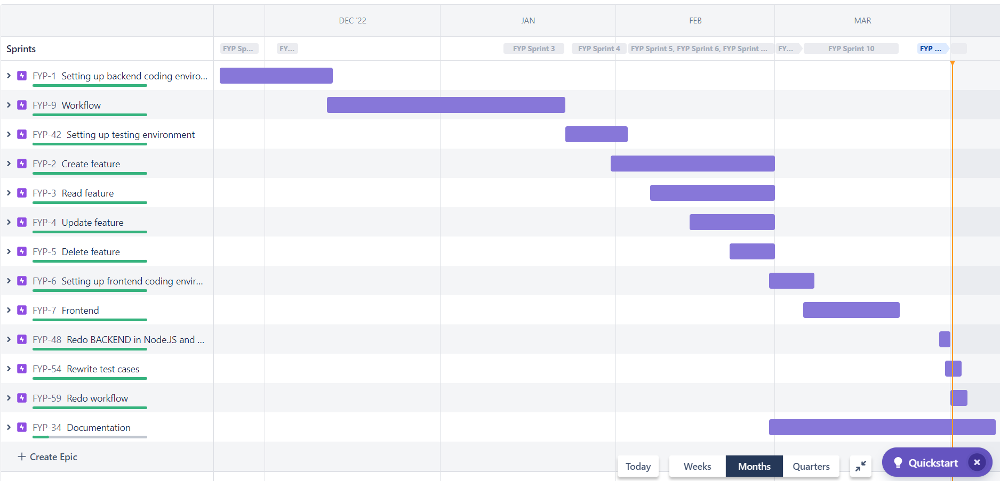

# Student Grade System
This repository serves as my final year project at Atlantic Technology University. The project focuses on designing a **Continuous Integration/Continuous Deployment (CI/CD) pipeline** using **GitHub Actions** while developing a simple student grade management website using MERN stack with basic CRUD functionalities.

## CI/CD pipeline implementation
The `check.yml` in `.github/workflow` of the repository shows the full workflow of this project.

Here's how the workflow works.

1. This specifies when the workflow should run. In this case, the workflow will be triggered whenever a commit is pushed to the main branch.
```bash
on:
  push:
    branches:
      - main
```
2. This defines a job named "build" that will run on the latest version of Ubuntu.
```bash
jobs:
  build:
    name: Build
    runs-on: ubuntu-latest
```
3. This step checks out the repository for the workflow to access.
```bash
steps:
  - name: Checkout
    uses: actions/checkout@v3
```
3. These steps set up the environment by installing Node.js and the required dependencies.
```bash
  - name: Setup Node.js
    uses: actions/setup-node@v2
    with: 
      node-version: "18.x"
  - name: Install dependencies
    run: npm install
```
4. This step runs the test suite for the website.
```bash
- name: Run test
    run: npm test
```
5. This step deploys the website to Heroku. The heroku_api_key is stored in secrets, and the heroku_app_name is set as "student-grade-system". The heroku_email is the email address of the account the deploye the project.
```bash
  - name: Deploy to Heroku
    uses: akhileshns/heroku-deploy@v3.12.12
    with:
      heroku_api_key: ${{ secrets.HEROKU_API_KEY }}
      heroku_app_name: "student-grade-system"
      heroku_email: "g00377198@atu.ie"
```

The student grade system deployed from this repository can be accessed __[here](https://student-grade-system.herokuapp.com/)__. The website is built using **React.js** as the front-end and **MongoDB** as the database. Initially, the backend server was developed in **Go** language, but it was later changed to **Node.js** and **Express.js** due to deployment compatibility and issues. Next, **Jest** and **Supertest** were used to write tests for testing, and **Heroku** was used for deployment. Lastly, **Jira**, a project management software, is utilised to plan and track project progress as shown below with a roadmap.



## Objectives
- To demonstrate an understanding of principles and practices of continuous integration and deployment for better efficiency.
- To enhance designing and developing a scalable web application using modern front-end frameworks and back-end technologies.
- To implement best practices for software development, such as testing and documentation.
- To develop skills in project management, including project planning and tracking.

## Directory Layout with Main Files Listed
This is the directory layout for the project, with the main files listed. The tree structure helps visualize the hierarchy of directories and files, while the main files listed provide an overview of the project's contents.

```bash
├── .github/workflows
│   └── checks.yml
├── BACKEND
│   └── server.js
├── dissertation
├── public
├── src
│   ├── components
│   │   ├── createSG.js
│   │   ├── listings.js
│   │   └── updateSG.js
│   ├── App.css
│   └── App.js
├── tests
│   └── crud.test.js
├── .gitignore
├── Procfile
├── README.md
├── package-lock.json
└── package.json
```

The main files listed are as follows:

- `.github/workflows/checks.yml`: This file sets up GitHub Actions to run checks on each push request to ensure that the code passes all tests and deploys automatically to Heroku..
- `BACKEND/server.js`: This file contains the backend code for the project, which handles CRUD API requests and database interactions.
- `dissertation`: This directory contains the author's dissertation in LaTeX format.
- `public`: This directory contains public files, such as images and static HTML files.
- `src`: This directory contains the main React source code for the project, including the *components* subdirectory that contains different pages of the website. The `App.js` file provides a navigation bar for every page, while the `App.css` file manages the CSS styles for the website.
- `tests/crud.test.js`: This file contains tests for the project, testing the Create, Read, Update, and Delete (CRUD) functionality.
- `.gitignore`: This file specifies files and directories to be ignored by Git when committing changes. For this project, the `node_modules` and `build` folders are ignored, for instance."
- `Procfile`: This file is used by Heroku to specify the commands to run when the app is deployed. In this project, this file is used to start the server.
- `README.md`: This file provides an overview of the project.
- `package-lock.json`: This file specifies version numbers for dependencies to ensure consistency across installations.
- `package.json`: This file specifies the project's dependencies and scripts for running the app.

## Tools and Technologies
- **React.js** for front-end development.
- **Node.js** and **Express.js _(initially GO)_** for the server-side scripting.
- **MongoDB** for database management.
- **Git** for version control and repository management.
- **Github Actions** for continuous integration and deployment.
- **Jest** and **Supertest** for testing.
- **Heroku** for deployment.
- **Jira** for project management.

## Author
[Gabriel Hang](https://github.com/gabhang)